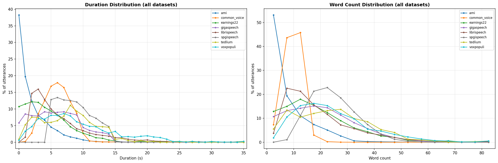
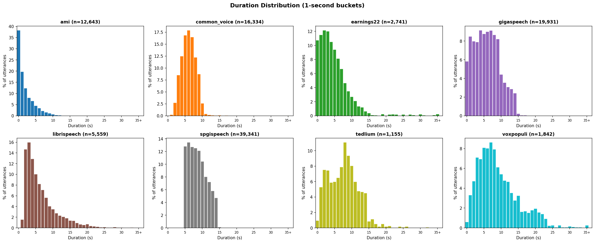
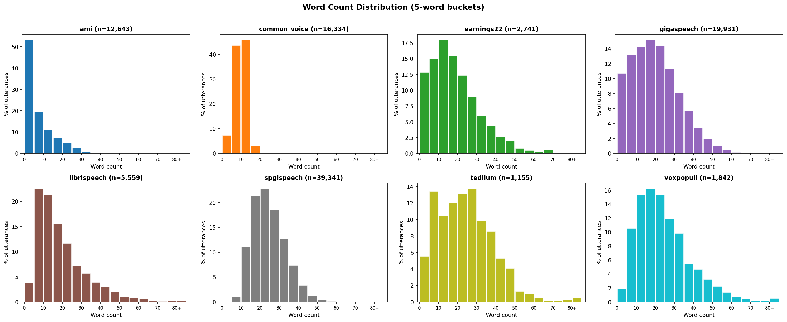

# OpenASR Dataset Statistics

## Combined Overlay

## Summary

| Dataset | Utterances | Total Hrs | Avg Dur(s) | Min Dur(s) | Max Dur(s) | Avg Words | Min Words | Max Words |
|---------|-----------|-----------|------------|------------|------------|-----------|-----------|-----------|
| ami | 12,643 | 8.7 | 2.5 | 0.0 | 26.2 | 7.1 | 1 | 75 |
| common_voice | 16,334 | 29.9 | 6.6 | 1.0 | 105.7 | 9.4 | 1 | 34 |
| earnings22 | 2,741 | 4.0 | 5.3 | 0.1 | 45.9 | 18.3 | 1 | 109 |
| gigaspeech | 19,931 | 35.4 | 6.4 | 0.1 | 22.0 | 19.7 | 1 | 76 |
| librispeech | 5,559 | 10.7 | 7.0 | 1.2 | 35.0 | 18.9 | 1 | 119 |
| spgispeech | 39,341 | 100.0 | 9.2 | 5.0 | 15.0 | 24.1 | 4 | 68 |
| tedlium | 1,155 | 2.6 | 8.2 | 0.3 | 32.5 | 23.8 | 1 | 121 |
| voxpopuli | 1,842 | 4.9 | 9.6 | 0.6 | 69.2 | 24.1 | 1 | 182 |
| **TOTAL** | **99,546** | **196.3** | | | | | | |

## Duration Distribution (1-second buckets)

### ami (12,643 utterances)

| Bucket(s) | Count | % |
|-----------|-------|---|
| 0-1 | 4,838 | 38.3% |
| 1-2 | 2,497 | 19.8% |
| 2-3 | 1,561 | 12.3% |
| 3-4 | 1,023 | 8.1% |
| 4-5 | 843 | 6.7% |
| 5-6 | 575 | 4.5% |
| 6-7 | 441 | 3.5% |
| 7-8 | 278 | 2.2% |
| 8-9 | 205 | 1.6% |
| 9-10 | 150 | 1.2% |
| 10-11 | 91 | 0.7% |
| 11-12 | 48 | 0.4% |
| 12-13 | 32 | 0.3% |
| 13-14 | 15 | 0.1% |
| 14-15 | 13 | 0.1% |
| 15-16 | 8 | 0.1% |
| 16-17 | 5 | 0.0% |
| 17-18 | 7 | 0.1% |
| 18-19 | 2 | 0.0% |
| 19-20 | 2 | 0.0% |
| 20-21 | 2 | 0.0% |
| 21-22 | 2 | 0.0% |
| 22-23 | 1 | 0.0% |
| 23-24 | 3 | 0.0% |
| 26-27 | 1 | 0.0% |

### common_voice (16,334 utterances)

| Bucket(s) | Count | % |
|-----------|-------|---|
| 0-1 | 1 | 0.0% |
| 1-2 | 38 | 0.2% |
| 2-3 | 450 | 2.8% |
| 3-4 | 1,393 | 8.5% |
| 4-5 | 2,042 | 12.5% |
| 5-6 | 2,751 | 16.8% |
| 6-7 | 2,924 | 17.9% |
| 7-8 | 2,690 | 16.5% |
| 8-9 | 1,998 | 12.2% |
| 9-10 | 1,425 | 8.7% |
| 10-11 | 430 | 2.6% |
| 11-12 | 65 | 0.4% |
| 12-13 | 31 | 0.2% |
| 13-14 | 17 | 0.1% |
| 14-15 | 11 | 0.1% |
| 15-16 | 16 | 0.1% |
| 16-17 | 5 | 0.0% |
| 17-18 | 11 | 0.1% |
| 18-19 | 6 | 0.0% |
| 19-20 | 2 | 0.0% |
| 20-21 | 6 | 0.0% |
| 21-22 | 7 | 0.0% |
| 22-23 | 1 | 0.0% |
| 23-24 | 1 | 0.0% |
| 24-25 | 3 | 0.0% |
| 27-28 | 2 | 0.0% |
| 29-30 | 1 | 0.0% |
| 49-50 | 2 | 0.0% |
| 51-52 | 1 | 0.0% |
| 66-67 | 1 | 0.0% |
| 68-69 | 2 | 0.0% |
| 105-106 | 1 | 0.0% |

### earnings22 (2,741 utterances)

| Bucket(s) | Count | % |
|-----------|-------|---|
| 0-1 | 294 | 10.7% |
| 1-2 | 315 | 11.5% |
| 2-3 | 333 | 12.1% |
| 3-4 | 329 | 12.0% |
| 4-5 | 288 | 10.5% |
| 5-6 | 258 | 9.4% |
| 6-7 | 223 | 8.1% |
| 7-8 | 183 | 6.7% |
| 8-9 | 128 | 4.7% |
| 9-10 | 96 | 3.5% |
| 10-11 | 74 | 2.7% |
| 11-12 | 58 | 2.1% |
| 12-13 | 37 | 1.3% |
| 13-14 | 33 | 1.2% |
| 14-15 | 18 | 0.7% |
| 15-16 | 11 | 0.4% |
| 16-17 | 3 | 0.1% |
| 17-18 | 2 | 0.1% |
| 19-20 | 7 | 0.3% |
| 20-21 | 1 | 0.0% |
| 21-22 | 5 | 0.2% |
| 22-23 | 6 | 0.2% |
| 23-24 | 5 | 0.2% |
| 25-26 | 5 | 0.2% |
| 26-27 | 1 | 0.0% |
| 27-28 | 5 | 0.2% |
| 28-29 | 3 | 0.1% |
| 30-31 | 6 | 0.2% |
| 31-32 | 2 | 0.1% |
| 32-33 | 1 | 0.0% |
| 33-34 | 1 | 0.0% |
| 34-35 | 3 | 0.1% |
| 36-37 | 3 | 0.1% |
| 38-39 | 1 | 0.0% |
| 41-42 | 2 | 0.1% |
| 45-46 | 1 | 0.0% |

### gigaspeech (19,931 utterances)

| Bucket(s) | Count | % |
|-----------|-------|---|
| 0-1 | 1,163 | 5.8% |
| 1-2 | 1,696 | 8.5% |
| 2-3 | 1,591 | 8.0% |
| 3-4 | 1,574 | 7.9% |
| 4-5 | 1,826 | 9.2% |
| 5-6 | 1,751 | 8.8% |
| 6-7 | 1,798 | 9.0% |
| 7-8 | 1,821 | 9.1% |
| 8-9 | 1,728 | 8.7% |
| 9-10 | 1,637 | 8.2% |
| 10-11 | 881 | 4.4% |
| 11-12 | 710 | 3.6% |
| 12-13 | 616 | 3.1% |
| 13-14 | 573 | 2.9% |
| 14-15 | 485 | 2.4% |
| 15-16 | 48 | 0.2% |
| 16-17 | 14 | 0.1% |
| 17-18 | 11 | 0.1% |
| 18-19 | 4 | 0.0% |
| 19-20 | 2 | 0.0% |
| 20-21 | 1 | 0.0% |
| 22-23 | 1 | 0.0% |

### librispeech (5,559 utterances)

| Bucket(s) | Count | % |
|-----------|-------|---|
| 1-2 | 86 | 1.5% |
| 2-3 | 817 | 14.7% |
| 3-4 | 888 | 16.0% |
| 4-5 | 717 | 12.9% |
| 5-6 | 557 | 10.0% |
| 6-7 | 457 | 8.2% |
| 7-8 | 394 | 7.1% |
| 8-9 | 314 | 5.6% |
| 9-10 | 226 | 4.1% |
| 10-11 | 194 | 3.5% |
| 11-12 | 153 | 2.8% |
| 12-13 | 128 | 2.3% |
| 13-14 | 115 | 2.1% |
| 14-15 | 102 | 1.8% |
| 15-16 | 77 | 1.4% |
| 16-17 | 75 | 1.3% |
| 17-18 | 51 | 0.9% |
| 18-19 | 37 | 0.7% |
| 19-20 | 32 | 0.6% |
| 20-21 | 39 | 0.7% |
| 21-22 | 21 | 0.4% |
| 22-23 | 16 | 0.3% |
| 23-24 | 13 | 0.2% |
| 24-25 | 6 | 0.1% |
| 25-26 | 8 | 0.1% |
| 26-27 | 4 | 0.1% |
| 27-28 | 4 | 0.1% |
| 28-29 | 8 | 0.1% |
| 29-30 | 4 | 0.1% |
| 30-31 | 4 | 0.1% |
| 31-32 | 3 | 0.1% |
| 32-33 | 3 | 0.1% |
| 33-34 | 4 | 0.1% |
| 34-35 | 2 | 0.0% |

### spgispeech (39,341 utterances)

| Bucket(s) | Count | % |
|-----------|-------|---|
| 5-6 | 5,040 | 12.8% |
| 6-7 | 5,285 | 13.4% |
| 7-8 | 5,002 | 12.7% |
| 8-9 | 4,930 | 12.5% |
| 9-10 | 4,767 | 12.1% |
| 10-11 | 4,109 | 10.4% |
| 11-12 | 3,166 | 8.0% |
| 12-13 | 2,846 | 7.2% |
| 13-14 | 2,282 | 5.8% |
| 14-15 | 1,862 | 4.7% |
| 15-16 | 52 | 0.1% |

### tedlium (1,155 utterances)

| Bucket(s) | Count | % |
|-----------|-------|---|
| 0-1 | 11 | 1.0% |
| 1-2 | 61 | 5.3% |
| 2-3 | 87 | 7.5% |
| 3-4 | 86 | 7.4% |
| 4-5 | 68 | 5.9% |
| 5-6 | 69 | 6.0% |
| 6-7 | 75 | 6.5% |
| 7-8 | 91 | 7.9% |
| 8-9 | 128 | 11.1% |
| 9-10 | 108 | 9.4% |
| 10-11 | 93 | 8.1% |
| 11-12 | 69 | 6.0% |
| 12-13 | 55 | 4.8% |
| 13-14 | 54 | 4.7% |
| 14-15 | 52 | 4.5% |
| 15-16 | 10 | 0.9% |
| 16-17 | 13 | 1.1% |
| 17-18 | 6 | 0.5% |
| 18-19 | 2 | 0.2% |
| 19-20 | 6 | 0.5% |
| 20-21 | 2 | 0.2% |
| 21-22 | 3 | 0.3% |
| 24-25 | 2 | 0.2% |
| 25-26 | 1 | 0.1% |
| 26-27 | 2 | 0.2% |
| 32-33 | 1 | 0.1% |

### voxpopuli (1,842 utterances)

| Bucket(s) | Count | % |
|-----------|-------|---|
| 0-1 | 11 | 0.6% |
| 1-2 | 61 | 3.3% |
| 2-3 | 87 | 4.7% |
| 3-4 | 131 | 7.1% |
| 4-5 | 128 | 6.9% |
| 5-6 | 149 | 8.1% |
| 6-7 | 148 | 8.0% |
| 7-8 | 159 | 8.6% |
| 8-9 | 146 | 7.9% |
| 9-10 | 113 | 6.1% |
| 10-11 | 100 | 5.4% |
| 11-12 | 88 | 4.8% |
| 12-13 | 86 | 4.7% |
| 13-14 | 65 | 3.5% |
| 14-15 | 51 | 2.8% |
| 15-16 | 60 | 3.3% |
| 16-17 | 30 | 1.6% |
| 17-18 | 31 | 1.7% |
| 18-19 | 28 | 1.5% |
| 19-20 | 33 | 1.8% |
| 20-21 | 36 | 2.0% |
| 21-22 | 29 | 1.6% |
| 22-23 | 26 | 1.4% |
| 23-24 | 17 | 0.9% |
| 24-25 | 4 | 0.2% |
| 25-26 | 5 | 0.3% |
| 26-27 | 1 | 0.1% |
| 27-28 | 5 | 0.3% |
| 28-29 | 1 | 0.1% |
| 29-30 | 1 | 0.1% |
| 30-31 | 3 | 0.2% |
| 31-32 | 2 | 0.1% |
| 32-33 | 1 | 0.1% |
| 33-34 | 1 | 0.1% |
| 38-39 | 3 | 0.2% |
| 39-40 | 1 | 0.1% |
| 69-70 | 1 | 0.1% |

## Word Count Distribution (5-word buckets)

### ami (12,643 utterances)

| Bucket(words) | Count | % |
|---------------|-------|---|
| 0-5 | 6,719 | 53.1% |
| 5-10 | 2,450 | 19.4% |
| 10-15 | 1,398 | 11.1% |
| 15-20 | 938 | 7.4% |
| 20-25 | 645 | 5.1% |
| 25-30 | 334 | 2.6% |
| 30-35 | 74 | 0.6% |
| 35-40 | 34 | 0.3% |
| 40-45 | 23 | 0.2% |
| 45-50 | 15 | 0.1% |
| 50-55 | 4 | 0.0% |
| 55-60 | 3 | 0.0% |
| 60-65 | 1 | 0.0% |
| 65-70 | 1 | 0.0% |
| 70-75 | 1 | 0.0% |
| 75-80 | 3 | 0.0% |

### common_voice (16,334 utterances)

| Bucket(words) | Count | % |
|---------------|-------|---|
| 0-5 | 1,194 | 7.3% |
| 5-10 | 7,132 | 43.7% |
| 10-15 | 7,475 | 45.8% |
| 15-20 | 487 | 3.0% |
| 20-25 | 40 | 0.2% |
| 25-30 | 5 | 0.0% |
| 30-35 | 1 | 0.0% |

### earnings22 (2,741 utterances)

| Bucket(words) | Count | % |
|---------------|-------|---|
| 0-5 | 352 | 12.8% |
| 5-10 | 411 | 15.0% |
| 10-15 | 492 | 17.9% |
| 15-20 | 422 | 15.4% |
| 20-25 | 339 | 12.4% |
| 25-30 | 247 | 9.0% |
| 30-35 | 164 | 6.0% |
| 35-40 | 120 | 4.4% |
| 40-45 | 71 | 2.6% |
| 45-50 | 56 | 2.0% |
| 50-55 | 22 | 0.8% |
| 55-60 | 13 | 0.5% |
| 60-65 | 7 | 0.3% |
| 65-70 | 17 | 0.6% |
| 70-75 | 2 | 0.1% |
| 75-80 | 3 | 0.1% |
| 90-95 | 1 | 0.0% |
| 95-100 | 1 | 0.0% |
| 105-110 | 1 | 0.0% |

### gigaspeech (19,931 utterances)

| Bucket(words) | Count | % |
|---------------|-------|---|
| 0-5 | 2,135 | 10.7% |
| 5-10 | 2,628 | 13.2% |
| 10-15 | 2,829 | 14.2% |
| 15-20 | 3,021 | 15.2% |
| 20-25 | 2,871 | 14.4% |
| 25-30 | 2,260 | 11.3% |
| 30-35 | 1,625 | 8.2% |
| 35-40 | 1,139 | 5.7% |
| 40-45 | 688 | 3.5% |
| 45-50 | 390 | 2.0% |
| 50-55 | 213 | 1.1% |
| 55-60 | 88 | 0.4% |
| 60-65 | 28 | 0.1% |
| 65-70 | 12 | 0.1% |
| 70-75 | 3 | 0.0% |
| 75-80 | 1 | 0.0% |

### librispeech (5,559 utterances)

| Bucket(words) | Count | % |
|---------------|-------|---|
| 0-5 | 209 | 3.8% |
| 5-10 | 1,254 | 22.6% |
| 10-15 | 1,183 | 21.3% |
| 15-20 | 867 | 15.6% |
| 20-25 | 647 | 11.6% |
| 25-30 | 403 | 7.2% |
| 30-35 | 316 | 5.7% |
| 35-40 | 217 | 3.9% |
| 40-45 | 166 | 3.0% |
| 45-50 | 112 | 2.0% |
| 50-55 | 59 | 1.1% |
| 55-60 | 46 | 0.8% |
| 60-65 | 36 | 0.6% |
| 65-70 | 13 | 0.2% |
| 70-75 | 7 | 0.1% |
| 75-80 | 11 | 0.2% |
| 80-85 | 6 | 0.1% |
| 85-90 | 4 | 0.1% |
| 90-95 | 1 | 0.0% |
| 95-100 | 1 | 0.0% |
| 115-120 | 1 | 0.0% |

### spgispeech (39,341 utterances)

| Bucket(words) | Count | % |
|---------------|-------|---|
| 0-5 | 9 | 0.0% |
| 5-10 | 425 | 1.1% |
| 10-15 | 4,373 | 11.1% |
| 15-20 | 8,377 | 21.3% |
| 20-25 | 8,976 | 22.8% |
| 25-30 | 7,301 | 18.6% |
| 30-35 | 4,975 | 12.6% |
| 35-40 | 2,901 | 7.4% |
| 40-45 | 1,317 | 3.3% |
| 45-50 | 490 | 1.2% |
| 50-55 | 151 | 0.4% |
| 55-60 | 42 | 0.1% |
| 60-65 | 2 | 0.0% |
| 65-70 | 2 | 0.0% |

### tedlium (1,155 utterances)

| Bucket(words) | Count | % |
|---------------|-------|---|
| 0-5 | 64 | 5.5% |
| 5-10 | 155 | 13.4% |
| 10-15 | 121 | 10.5% |
| 15-20 | 139 | 12.0% |
| 20-25 | 152 | 13.2% |
| 25-30 | 159 | 13.8% |
| 30-35 | 114 | 9.9% |
| 35-40 | 99 | 8.6% |
| 40-45 | 61 | 5.3% |
| 45-50 | 47 | 4.1% |
| 50-55 | 15 | 1.3% |
| 55-60 | 11 | 1.0% |
| 60-65 | 6 | 0.5% |
| 65-70 | 1 | 0.1% |
| 70-75 | 2 | 0.2% |
| 75-80 | 3 | 0.3% |
| 80-85 | 3 | 0.3% |
| 85-90 | 2 | 0.2% |
| 120-125 | 1 | 0.1% |

### voxpopuli (1,842 utterances)

| Bucket(words) | Count | % |
|---------------|-------|---|
| 0-5 | 34 | 1.8% |
| 5-10 | 194 | 10.5% |
| 10-15 | 282 | 15.3% |
| 15-20 | 299 | 16.2% |
| 20-25 | 282 | 15.3% |
| 25-30 | 220 | 11.9% |
| 30-35 | 181 | 9.8% |
| 35-40 | 101 | 5.5% |
| 40-45 | 86 | 4.7% |
| 45-50 | 60 | 3.3% |
| 50-55 | 41 | 2.2% |
| 55-60 | 25 | 1.4% |
| 60-65 | 13 | 0.7% |
| 65-70 | 9 | 0.5% |
| 70-75 | 3 | 0.2% |
| 75-80 | 2 | 0.1% |
| 80-85 | 2 | 0.1% |
| 85-90 | 4 | 0.2% |
| 95-100 | 1 | 0.1% |
| 105-110 | 1 | 0.1% |
| 110-115 | 1 | 0.1% |
| 180-185 | 1 | 0.1% |
